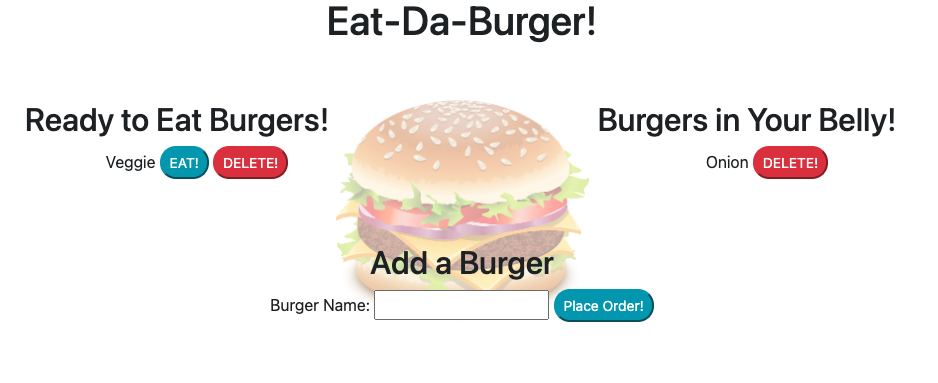

# Burger

## Table of Contents
* [Description](#description)
* [Visuals](#visuals)
* [Installation](#installation)
* [Usage](#usage)
* [Contributors](#contributors)
* [License](#license)
* [Questions](#questions)

## Description
This is an app that will save different entries, in this case burgers, and allow the user to modify the entries and delete them. 

This app uses mysql, express, and express-handlebars. 

## Visuals
### Demo

## Screenshot

## Installation 
Cloning repo from [Github](https://github.com/omarcossio/burger)
npm install express
npm install mysql
npm install express-handlebars

## Usage 
Using this app is very simple. If running app locally, npm start will begin the server and bring in terminal the server link to open in browser. Once it has been opened, user will have the ability to "eat", "order" or delete a burger. The eaten burgers will go into a different seccion so that the user can know what burgers they have created and "eaten". 

## Contributors
Omar Cossio

## License

Permission to use, copy, modify, and/or distribute this software for any purpose with or without fee is hereby granted, provided that the above copyright notice and this permission notice appear in all copies.

## Questions
* Click this link to see the code on [Github](https://github.com/omarcossio/burger).
* [Omar’s Email](mailto:omar119mce@gmail.com)
